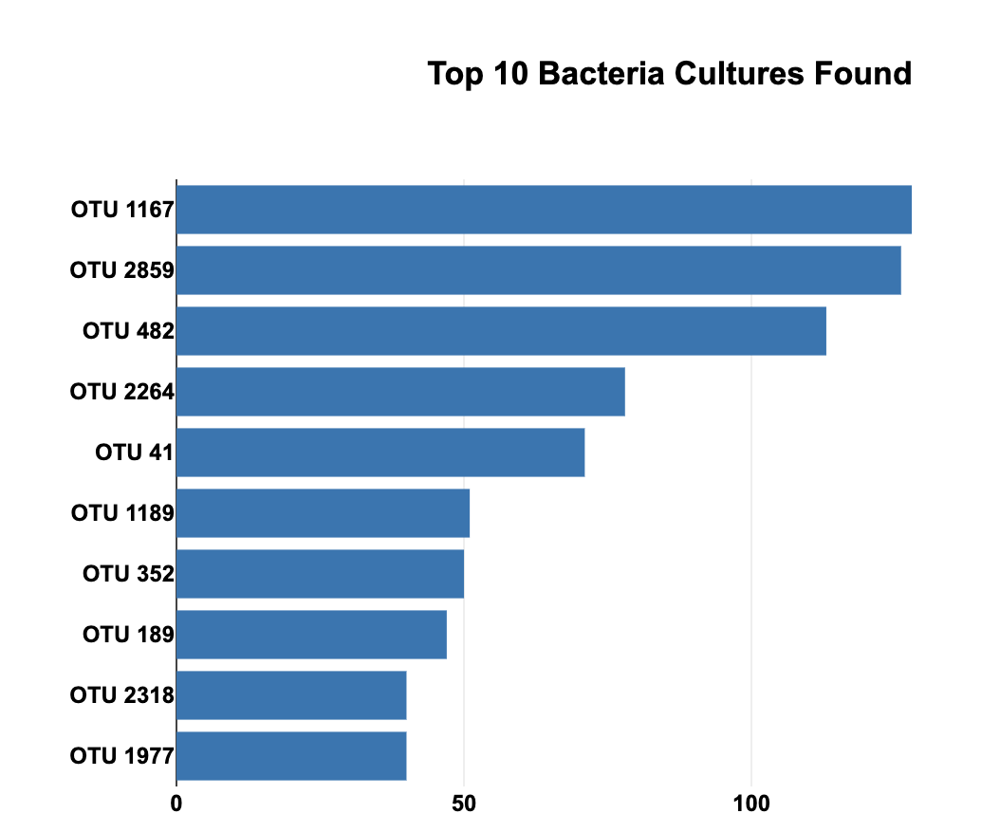
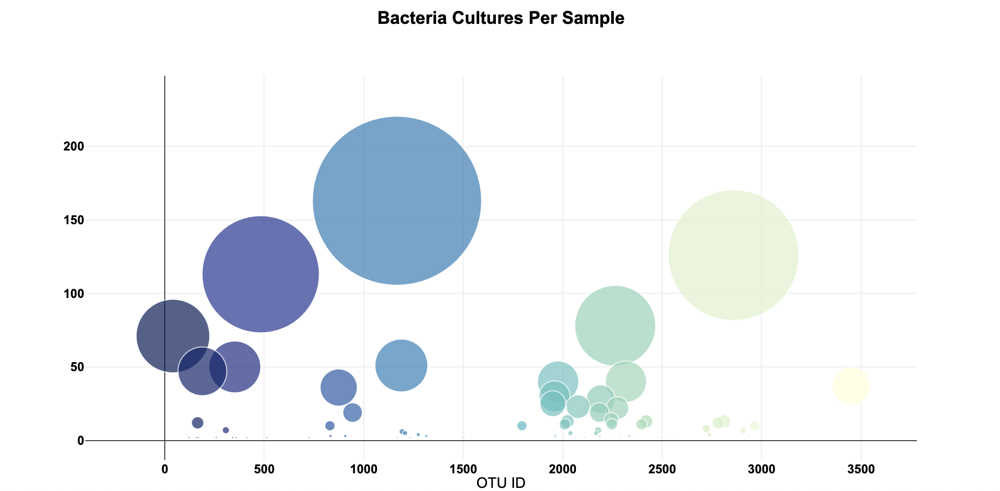
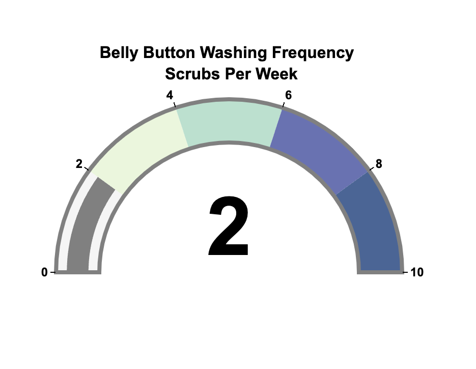
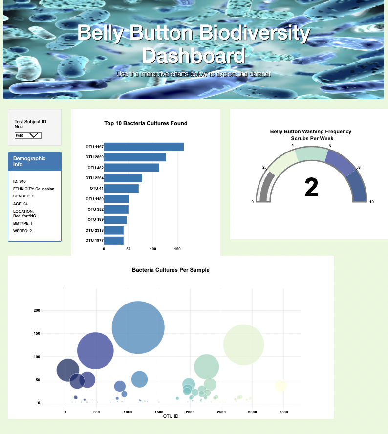

# Bellybutton_Biodiversity

## Project Overview 
In this challenge, I created a dashboard using Plotly libaries and JavaScript. 

View web app here: https://sambrazneal.github.io/Bellybutton_Biodiversity/

## Deliverable 1 

## Deliverable 2 

## Deliverable 3

## Deliverable 4 

